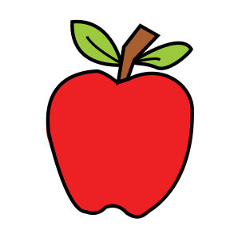

:::exercise fill-blanks
prompt: Complete the sentence.
text: She [[verb]] to school every [[when]].
- [verb] walks
- [when] morning
- [ ] walk
- [ ] yesterday
explanation-correct: *She* takes the **-s** form, *walks*, and *every* asks for a time that repeats: *every morning*.
:::

:::exercise order-sentences
prompt: Put the morning in order.
- [1] I wake up at seven.
- [2] I have breakfast.
- [3] I brush my teeth.
- [4] I leave the house.
:::

:::exercise construct-sentence
prompt: Build the sentence.
- [1] The cat
- [2] is sleeping
- [3] on the sofa.
:::

:::exercise match-translations
prompt: Match each picture with its word.
-  => apple
-  => dog
-  => house
-  => book
:::

:::exercise match-opposites
prompt: Match each word with its opposite.
- big => small
- hot => cold
- early => late
- open => closed
:::

:::exercise match-definitions
prompt: Match each definition with its word.
direction: definition-to-word
- A place where you borrow books => library
- The meal you eat in the morning => breakfast
- A person who teaches => teacher
:::

:::exercise single-choice
prompt: What is the weather like?
image: images/arasaac-rain.png {width=30 align=center}
- [x] It is raining.
- [ ] It is sunny.
- [ ] It is snowing.
explanation-correct: The cloud and the drops say it: *it is raining*.
:::

:::exercise incorrect-part
prompt: One part of this sentence is wrong. Which one?⏎[Yesterday she go to the market with her brother.]{no-bold}
- [ ] Yesterday
- [x] she go
- [ ] to the market
- [ ] with her brother.
explanation-correct: *Yesterday* asks for the past: *she went*.
:::

:::exercise odd-one-out
prompt: Which word does not belong with the others?
- [ ] Monday
- [ ] Tuesday
- [x] January
- [ ] Friday
explanation-correct: *January* is a month; the others are days of the week.
:::

:::exercise choose-all
prompt: Choose every fruit.
- [x] apple
- [x] banana
- [ ] carrot
- [x] orange
- [ ] potato
:::

:::exercise yes-no
prompt: Look at the picture and answer each question.
image: images/arasaac-dog.png {width=30 align=center}
- Is this a dog? => yes
- Is this a cat? => no
- Does it have four legs? => yes
:::

:::exercise true-false
prompt: Read, then decide whether each statement is true or false.⏎[Anna lives in a small house near the sea. Every morning she walks to the bakery and buys fresh bread.]{no-bold}
- Anna lives near the sea. => true
- She drives to the bakery. => false
- She buys bread in the morning. => true
:::

:::exercise flashcard
card-type: vocab
target: breakfast
meaning: the first meal of the day
context: I have breakfast at seven.
notes: *To have* breakfast, never *to do* breakfast.
:::

:::exercise flashcard
card-type: opposites
target: early
opposite: late
notes: I get up *early*; the train is *late*.
:::

:::exercise flashcard
card-type: jolly
front-primary: to look forward to
front-secondary: a phrasal verb
back-primary: |
  To wait for something **with pleasure**.

  | after it | example |
  |---|---|
  | a noun | I look forward to *the holidays*. |
  | a verb in *-ing* | I look forward to *seeing* you. |
back-secondary: |
  > Never *to see*: here *to* is a preposition.
:::
